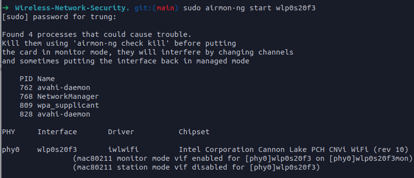
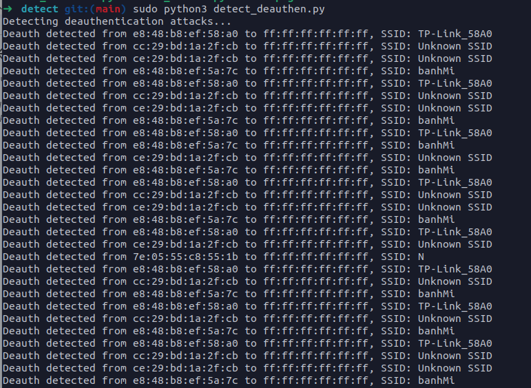

# Tấn công kết hợp Deauthentication và Rogue Access Point

**A.Chuẩn bị:**

**I.Công cụ:**

- Airmon-ng
- NodeMCU Flasher : https://github.com/nodemcu/nodemcu-flasher
- Captive Portal: : [https://github.com/D3vKn1ght/ESP8266-Captive-Portal](https://github.com/D3vKn1ght/ESP8266-Captive-Portal)
- Code demo: [https://github.com/D3vKn1ght/Wireless-Network-Security](https://github.com/D3vKn1ght/Wireless-Network-Security).

**II.Triển khai Captive Portal:**

Sau khi tải source code captive portal, tiến hành nạp code vào một ESP8266.

Để đơn giản, có thể sử dụng bản release có sẵn: [https://github.com/D3vKn1ght/ESP8266-Captive-Portal/releases/download/v1.0/WiFi_Captive_Portal.ino.bin](https://github.com/D3vKn1ght/ESP8266-Captive-Portal/releases/download/v1.0/WiFi_Captive_Portal.ino.bin)

Mở **NodeMCU Flasher** kết nối với port của ESP8266.

Vào config thêm file bin vừa tải ở trên vào:

Tiến hành ấn flash, sau khi flash hoàn thành sẽ có một captive portal trên ESP8266.

**III. Bật monitor mode wifi:**

Gõ lệnh **iwconfig** tìm interface của card wifi, ví dụ : **wlp0s20f3**

Tiến hành chuyển card wifi sang monitor mode:

**B. Demo:**

**I. Tấn công:**

1. **Cấu hình captive portal:**

Kết nối captive portal qua wifi, truy cập **172.0.0.1/ssid** thay đổi ssid bằng ssid cần tấn công giả mạo.

Trong danh sách hiển thị wifi nhìn thấy một điểm truy cập có ssid giống với ssid của điểm truy cập cần tấn công.

Tuy nhiên, victim sẽ không tự động truy cập vào điểm truy cập giả mạo. Tấn công, deautheication để khuyến khích victim truy cập điểm cập giả mạo.

1. **Tấn công deauthentication:**

Sau khi tải code demo, ta được các tệp dưới đây:

Trên terminal nhập: **sudo python3 showwificlient.py** để lấy địa chỉ MAC của client, BSSID của điểm truy cập cần tấn công. Ở đây ta tìm kiếm điểm truy cập có tên là banhMi.

Tiến hành nhập interface mà ta thấy ở bước chuẩn bị, ở đây là wlp0s20f3mon.

Ta có địa chỉ BSSID là  **E8:48:B8:EF:5A:7C**, MAC kết nối tới điểm truy cập SSID banhMi là **00:D2:79:B3:D4:D4:**

Mở một tab mới, nhập lệnh : **sudo python3 deauthen.py.** Nhập interface, bssid, ssid thu được ở trên:

Công cụ hiển thị thông tin gói tin deauthen, nhấn Enter để tiếp tục tấn công. Sau khi ấn Enter, công cụ hiển thị log đang tấn công deauthen và trên thiết bị kết nối wifi đã bị mất kết nối wifi.

Lúc này, victim thử kết nối với điểm truy cập sẽ không kết nối được.

Nhận thấy có một điểm truy cập có cấu hình giống với cấu hình thật hiển thị. Khi victim kết nối tới điểm truy cập giả mạo này, một trang web thông báo wifi lỗi thời, cần nhập mật khẩu để cập nhật.

Khi victim nhập mật khẩu, điểm truy cập giả mạo sẽ chuyển tiếp đến trang web đang cập nhật, vui lòng chờ.

1. **Tấn công deauthentication:**

Lúc này, chúng ta mở địa chỉ **172.0.0.1/pass** sẽ thu được ssid, mật khẩu của điểm truy cập thật.

**II. Phòng thủ:**

Để phát hiện cuộc tấn công deauthen, ta chạy lệnh **sudo python3 detect_deauthen.py** để tiến hành bắt các gói tin beacon và gói tin deauthen.

****Khi có cuộc tấn công, công cụ hiển thị thông tin của cuộc tấn công deauthen:

